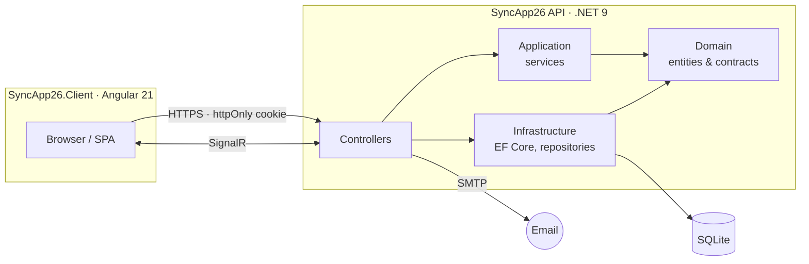

<div align="center">

# SyncApp26

**HR data synchronization and compliance-document platform**

Keeps employee records aligned with an external system of record through CSV import, and carries them through a multi-stage SSM/SU document signing process that remains cryptographically verifiable after the fact.

[](https://github.com/Tatu-Denis-Dimitrie/sync-app-26/actions/workflows/pipeline.yml) [](https://github.com/Tatu-Denis-Dimitrie/sync-app-26/tags)   [](LICENSE)

[Overview](#overview) · [Getting started](#getting-started) · [Architecture](#system-architecture) · [Security](#security) · [Documentation](#documentation)

</div>

---

## Overview

SyncApp26 solves two related problems for organizations that must maintain occupational health and safety (SSM) and workplace conduct (SU) documentation for their workforce.

**Keeping records accurate.** Employee data typically lives in an external HR system and is exported as CSV. SyncApp26 imports those exports, compares them against the current roster, and presents a reviewable summary of what is new, modified, unchanged, or missing — allowing per-field conflict resolution before any change is committed, rather than overwriting silently.

**Producing documentation that holds up.** Each SSM/SU document moves through a defined signing sequence involving the employee, their line manager, and an administrator. Every signature is recorded as an HMAC-chained entry that captures the exact state of the document and signer at the moment of signing, so the record can be independently re-verified later instead of simply trusted.

| | |
|:--|:--|
| **Signing sequence** | Employee → Line Manager → Administrator, each stage independently recorded and chained |
| **Session security** | httpOnly cookies · 15-minute access token · 8-hour rotating refresh token |
| **Import throughput** | 1,000 users in ~1.9 s · 100,000 users in ~19 s (measured) |
| **Authorization** | Enforced server-side on every request, for all five system roles |

---

## Key capabilities

### Data synchronization
- CSV import with `new` / `modified` / `unchanged` / `deleted` comparison and per-field conflict resolution
- Separate department synchronization pipeline
- Department lifecycle management: soft deletion, user transfer, and scheduled cleanup
- Complete import history and per-field change audit trail
- Real-time import progress streamed over SignalR

### Compliance documents
- SSM and SU document generation, individually or in bulk
- Staged signing workflow: `PendingUser → PendingManager → PendingAdmin → Completed`
- One-time, expiring tokens for signing links delivered by email
- HMAC-chained signature records with independent post-hoc verification
- On-demand PDF rendering of any generated document

### Training records
- Initial training data per user and document type
- Periodic training records with instructor and verifier signatures
- Bulk assignment across a department or the entire organization

### Administration
- Self-service data-change requests, reviewed and approved by an administrator, restricted to an explicit field allowlist
- Same-domain self-service email change with administrator approval
- Administrator "view as" impersonation with full audit logging and enforced read-only access
- Background verification sweep that re-validates stored signatures and reports anomalies

---

## System architecture



The solution follows a layered, DDD-influenced structure with a one-way dependency flow: **API → Application → Domain ← Infrastructure**. A **Shared** project carries DTOs used across all layers and consumed as JSON by the client. Business logic is distributed between the Application layer (synchronization, accounts, impersonation) and Infrastructure (document, signature, training, cryptography services).

Refer to [docs/02_architecture.md](docs/02_architecture.md) for full detail.

### Technology stack

| Layer | Technology |
|:--|:--|
| API | ASP.NET Core 9, Entity Framework Core, SignalR |
| Client | Angular 21 (standalone components), TypeScript |
| Persistence | SQLite via EF Core — see [capacity considerations](#performance-and-capacity) |
| Authentication | JWT in httpOnly cookies, database-backed refresh tokens, CSRF double-submit |
| Real-time | SignalR hub at `/hubs/sync` |
| Email | SMTP for verification, password reset, and signature notifications |
| Logging | Serilog with file rotation and retention |

---

## Getting started

### Prerequisites

- .NET 9 SDK
- Node.js, compatible with Angular 21

### Installation

```bash
# 1 — Configure the API
cd SyncApp26/SyncApp26.API
cp appsettings.example.json appsettings.json
# Set JwtSettings:SecretKey and the Smtp:* values

# 2 — Start the API — http://localhost:5022
cd ..
dotnet restore
dotnet run --project SyncApp26.API

# 3 — Start the SPA — http://localhost:4200 (separate terminal)
cd SyncApp26.Client
npm install
npm start
```

`appsettings.json` is intentionally excluded from source control. The SQLite database is created and seeded automatically on first run; deleting `SyncApp26/SyncApp26.Infrastructure/SyncApp26.db` resets all data. Swagger is available at `/swagger` in the Development environment.

### Seeded accounts

Provisioned on first run and pre-verified, so no SMTP configuration is required to sign in locally.

| Role | Email | Password |
|:--|:--|:--|
| Administrator | `admin@syncapp.com` | `admin123` |
| Line Manager | `manager@syncapp.com` | `manager123` |
| Basic User | `user@syncapp.com` | `user123` |

A complete walkthrough, including verification steps and troubleshooting, is available in [docs/01_getting-started.md](docs/01_getting-started.md).

---

## Usage

### CSV import format

User imports must be UTF-8 encoded and contain the following columns. Header names are matched case-insensitively and column order is not significant.

| Column | Required | Description |
|:--|:--:|:--|
| `PersonalId` | ● | Stable unique identifier from the source system |
| `FirstName` | ● | Given name |
| `LastName` | ● | Family name |
| `Email` | ● | Must be unique across the organization |
| `DepartmentName` | ● | Created automatically if it does not exist |
| `AssignedToPersonalId` | ○ | `PersonalId` of the assigned line manager |
| `Function` | ○ | Job function or position |
| `WorkSite` | ○ | Physical work location |

Passing `skipInvalidRows=true` tolerates malformed rows and reports them rather than failing the entire import. Representative files — including deliberately invalid ones for validation testing — are provided in [`sample-csvs/`](sample-csvs/).

### Roles and permissions

| Role | Scope |
|:--|:--|
| **Administrator** | Full system access; performs the final signing stage on SSM documents and resolves data-change requests |
| **Line Manager** | Direct reports only; generates and countersigns documents for assigned users |
| **Basic User** | Own record and signature actions |
| **SSM Officer** | Signing authority for SSM documents, granted independently of the roles above |
| **SU Officer** | Signing authority for SU documents, granted independently of the roles above |

Officer roles are additive: a user may hold either, both, or neither alongside their primary role. Additional custom roles can be defined by an administrator without a schema change.

### Testing

```bash
# Backend — xUnit
cd SyncApp26
dotnet test

# Frontend — Karma / Jasmine
cd SyncApp26/SyncApp26.Client
npm test
```

---

## Design decisions

Selected implementation details where the straightforward approach proved insufficient.

### Refresh token rotation with reuse detection

Each refresh operation consumes the presented token and issues a successor, retaining the consumed token's hash. A token presented a second time indicates possible theft rather than normal use, and revokes every active token for that user rather than only the token presented.

```mermaid
sequenceDiagram
    participant B as Browser
    participant A as API
    participant D as Database

    B->>A: Request with expired access token
    A-->>B: 401 Unauthorized
    B->>A: POST /api/authentication/refresh
    A->>D: Look up token hash
    alt Token previously consumed
        D-->>A: Reuse detected
        A->>D: Revoke all active tokens for user
        A-->>B: 401 — re-authentication required
    else First use
        A->>D: Mark consumed, issue successor
        A-->>B: New access and refresh cookies
        B->>A: Original request retried transparently
    end
```



Two browser tabs whose access tokens expire simultaneously will both present the same consumed token, which is indistinguishable from replay. A 30-second grace window treats this specific race as legitimate and issues a sibling token, while genuine reuse outside that window still triggers full revocation. Session lifetime remains absolute: a rotated token inherits its predecessor's expiry and never extends it.

### Verifiable signature records

Rather than storing a signature as an opaque value, each record captures the inputs that were material at signing time — document hash, signer identity, position, and work site — serialized into a canonical, length-prefixed byte sequence and sealed with an HMAC. Verification recomputes that HMAC from the stored snapshot, so the result does not depend on the current state of any related record. The serializer version is stored alongside each signature, allowing the schema to evolve without invalidating existing records.

See [docs/08_signature-safety.md](docs/08_signature-safety.md) for the complete cryptographic model.

### Session state without client-side tokens

The access token is delivered exclusively in an httpOnly cookie and is never readable from JavaScript. Client session state is established once at application startup through a single `GET /api/authentication/me` call, executed before the router's first navigation so route guards remain synchronous. CSRF protection uses ASP.NET Core's `IAntiforgery` in a configuration compatible with Angular's built-in XSRF interceptor, which requires no client-side implementation.

---

## Security

Session authentication is cookie-based end to end. A 15-minute access token is paired with a rotating refresh token persisted server-side for 8 hours, with reuse detection as described above. State-changing requests require CSRF validation. Sensitive and unauthenticated endpoints are rate-limited per IP address. Responses carry `Cache-Control: no-store`, a restrictive Content Security Policy, and standard security headers.

### Deployment checklist

- [ ] Replace the JWT signing key and SMTP credentials; never commit real values
- [ ] Set `Auth:Cookie:Secure` explicitly when running behind a reverse proxy
- [ ] Register `UseForwardedHeaders` before `UseHttpsRedirection` — it governs both cookie `Secure` determination and rate-limiter IP partitioning
- [ ] Serve `Content-Security-Policy: frame-ancestors 'none'` as a response header from the SPA host, as the directive is ignored in a `<meta>` tag
- [ ] Review [docs/configuration.md](docs/configuration.md) for the complete settings reference

---

## Performance and capacity

Controlled import testing against the current SQLite configuration produced the following end-to-end timings, inclusive of validation, comparison, and persistence:

| Import size | Duration |
|:--|:--|
| 1,000 users | ~1.9 s |
| 100,000 users | ~19 s |

Database stability degrades beyond approximately **250,000 users**, at which point a production-grade relational database is recommended and the synchronization workflows should be re-validated under representative load. Full methodology and results are documented in [docs/07_performance-and-capacity.md](docs/07_performance-and-capacity.md).

---

## Project structure

| Project | Responsibility |
|:--|:--|
| `SyncApp26.API` | Controllers, authentication, SignalR hub, hosted services, dependency injection |
| `SyncApp26.Application` | Business services behind interfaces — the orchestration layer |
| `SyncApp26.Domain` | Entities and repository contracts; no infrastructure dependency |
| `SyncApp26.Infrastructure` | EF Core context, repository implementations, seeding, document and signature services |
| `SyncApp26.Shared` | DTOs shared between API and client |
| `SyncApp26.Client` | Angular single-page application |
| `SyncApp26.Tests` | xUnit test suite |

---

## Documentation

| Document | Contents |
|:--|:--|
| [01 · Getting started](docs/01_getting-started.md) | Local setup, verification, troubleshooting |
| [02 · Architecture](docs/02_architecture.md) | Service communication, layering, persistence |
| [03 · Data model](docs/03_data-model.md) | Entities, relationships, indexes |
| [04 · Business workflows](docs/04_business-workflows.md) | Synchronization, documents, training, requests, notifications |
| [05 · API reference](docs/05_api-reference.md) | Endpoints, authentication conventions, payload shapes |
| [06 · Client application](docs/06_client-app.md) | Routes, guards, interceptors, session model |
| [07 · Performance and capacity](docs/07_performance-and-capacity.md) | Import benchmarks and scaling limits |
| [08 · Signature safety](docs/08_signature-safety.md) | HMAC chaining, cryptographic proof, verification |
| [Configuration](docs/configuration.md) | Complete API and client settings reference |

[docs/index.md](docs/index.md) provides the full documentation map.

---

## Contributing

Commit messages follow the [Conventional Commits](https://www.conventionalcommits.org/) specification (`feat:`, `fix:`, `chore:`, and related prefixes). The CI pipeline parses them to determine the semantic version increment and tags releases automatically on merge to `main`.

---

## License

Released under the [MIT License](LICENSE).
