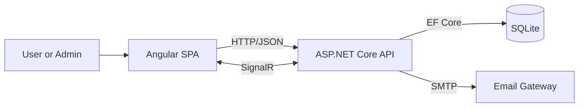
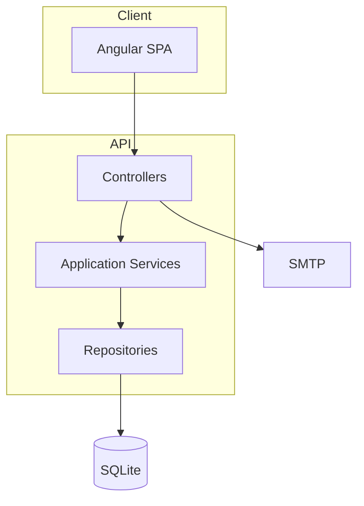

# Architecture

## System context
SyncApp26 provides HR data synchronization, compliance document generation, and multi-stage signature workflows. Users interact through the Angular SPA, while the API enforces business rules, persists data, and delivers notifications.

## Logical architecture
SyncApp26 uses a layered design aligned with domain-driven concepts:

| Layer | Responsibility | Key projects |
| --- | --- | --- |
| API | HTTP endpoints, authentication, SignalR | SyncApp26.API |
| Application | Business workflows, orchestration | SyncApp26.Application |
| Domain | Entities and repository contracts | SyncApp26.Domain |
| Infrastructure | EF Core persistence and repositories | SyncApp26.Infrastructure |
| Shared | DTOs and shared contracts | SyncApp26.Shared |
| Client | Angular SPA and UI | SyncApp26.Client |

## Dependency direction
- API depends on Application and Infrastructure.
- Application depends on Domain interfaces and Shared DTOs.
- Infrastructure implements Domain repositories and uses EF Core.
- Client uses Shared API contracts as JSON payloads.

## Runtime topology
- SPA and API run as separate processes.
- API hosts REST endpoints and the SignalR hub at /hubs/sync.
- SQLite is a local file database (SyncApp26.Infrastructure/SyncApp26.db by default).
- SMTP is used for account verification, password reset, and signature notifications.

## Component interactions

## Authentication and authorization
- JWT Bearer authentication is used for protected endpoints.
- Role claims drive authorization (Admin, Line Manager, Basic User).
- Public endpoints exist for registration, password reset, and token-based signing.
- Email verification is required before login.

## Data access and integrity
- EF Core is configured with SQLite.
- SaveChanges operations include retry logic for SQLite lock contention.
- Critical indexes are enforced for uniqueness and query performance (Email, PersonalId, Department/Function names).

## Real-time updates
- CSV sync progress can be streamed using X-Connection-Id or connectionId.
- Signature actions broadcast a SignatureUpdated event to all connected clients.

## Background services
- A hosted DepartmentCleanupService performs scheduled maintenance on department lifecycle data.

## Extensibility notes
- Business logic is expressed through service interfaces in SyncApp26.Application.IServices.
- Repository interfaces in SyncApp26.Domain.IRepositories allow storage substitution.
