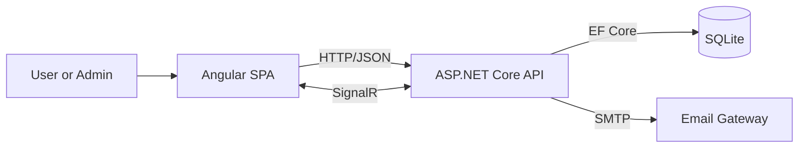
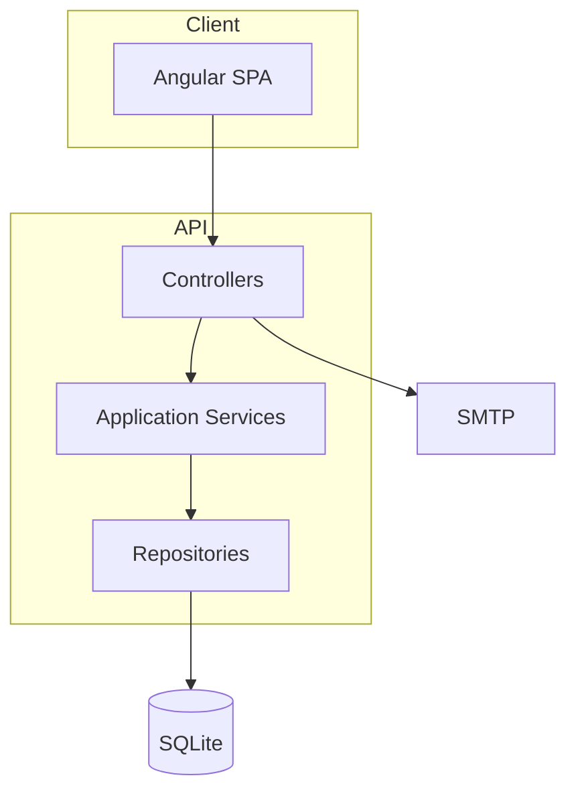

# Architecture

## System context
SyncApp26 provides HR data synchronization, compliance document generation, and multi-stage signature workflows. Users interact through the Angular SPA, while the API enforces business rules, persists data, and delivers notifications.

```mermaid
flowchart LR
  User[User or Admin] --> SPA[Angular SPA]
  SPA -->|HTTP/JSON| API[ASP.NET Core API]
  API -->|EF Core| DB[(SQLite)]
  API -->|SMTP| Mail[Email Gateway]
  API <-->|SignalR| SPA
```

## Logical architecture
SyncApp26 uses a layered design aligned with domain-driven concepts:

| Layer | Responsibility | Key projects |
| --- | --- | --- |
| API | HTTP endpoints, authentication, SignalR | SyncApp26.API |
| Application | Business workflows, orchestration | SyncApp26.Application |
| Domain | Entities and repository contracts | SyncApp26.Domain |
| Infrastructure | EF Core persistence and repositories | SyncApp26.Infrastructure |
| Shared | DTOs and shared contracts | SyncApp26.Shared |
| Client | Angular SPA and UI | SyncApp26.Client |
| Tests | xUnit test suite | SyncApp26.Tests |

Note: not all business logic lives in `SyncApp26.Application` — signature, document, periodic-training, and cryptography services live in `SyncApp26.Infrastructure/Services`. Check both locations when tracing a workflow.

## Dependency direction
- API depends on Application and Infrastructure.
- Application depends on Domain interfaces and Shared DTOs.
- Infrastructure implements Domain repositories and uses EF Core.
- Client uses Shared API contracts as JSON payloads.

## Runtime topology
- SPA and API run as separate processes.
- API hosts REST endpoints and the SignalR hub at /hubs/sync.
- SQLite is a local file database (SyncApp26.Infrastructure/SyncApp26.db by default).
- SMTP is used for account verification, password reset, and signature notifications.

## Component interactions

```mermaid
flowchart TB
  subgraph Client
    SPA[Angular SPA]
  end
  subgraph API
    Controllers[Controllers]
    Services[Application Services]
    Repos[Repositories]
  end
  DB[(SQLite)]
  SMTP[SMTP]

  SPA --> Controllers
  Controllers --> Services
  Services --> Repos
  Repos --> DB
  Controllers --> SMTP
```

## Authentication and authorization
- JWT-based session, carried in an httpOnly cookie set by login/refresh rather than a client-visible bearer token; an `Authorization: Bearer` header is still accepted as a fallback for non-browser callers. A refresh token (opaque, DB-backed, rotated on use) issues short-lived new access tokens without re-login.
- CSRF protection (`IAntiforgery` + Angular's built-in XSRF interceptor) guards unsafe methods against the cookie's ambient-credential risk; exempt for safe methods, `Authorization`-header requests, and a small set of pre-session/rotation endpoints.
- Role claims drive authorization across five roles: Admin, Line Manager, Basic User, SSM Officer, SU Officer. The last two are granted independently of the primary role.
- Public endpoints exist for registration, password reset, and token-based signing.
- Email verification is required before login.
- Global per-IP rate limiting (300 req/min) plus tighter named policies on login, other auth-sensitive endpoints, and signing-token endpoints — see `docs/05_api-reference.md`.
- Response security headers (`Cache-Control: no-store` on `/api`, a CSP served from the SPA's `index.html`) reduce the blast radius of cookie-based auth. See `docs/configuration.md`.
- `GlobalExceptionHandler` middleware centralizes unhandled-exception responses so controllers don't need per-action try/catch for that purpose.

## Data access and integrity
- EF Core is configured with SQLite: shared cache mode, connection pooling, a 60s default/command timeout, and the connection string's relative path resolved against `ContentRootPath`.
- SaveChanges operations include retry logic for SQLite lock contention.
- Critical indexes are enforced for uniqueness and query performance (Email, PersonalId, Department/Function/WorkSite names, plus several composite indexes — see `docs/03_data-model.md`).

## Real-time updates
- CSV sync progress can be streamed using X-Connection-Id or connectionId (`UploadProgress`, `ComparisonResult`, `SyncProgress` events).
- Signature actions broadcast a `SignatureUpdated` event to all connected clients.
- The background signature-verification sweep broadcasts `SignatureAnomalyAlert` when it finds a signature that no longer verifies.

## Background services
- `DepartmentCleanupService` performs scheduled maintenance on department lifecycle data.
- `SignatureVerificationSweepService` periodically re-verifies stored signatures and raises anomaly alerts on failure.
- `LogFileRetentionService` prunes old log files on a schedule.

## Extensibility notes
- Business logic is expressed through service interfaces in SyncApp26.Application.IServices.
- Repository interfaces in SyncApp26.Domain.IRepositories allow storage substitution.
