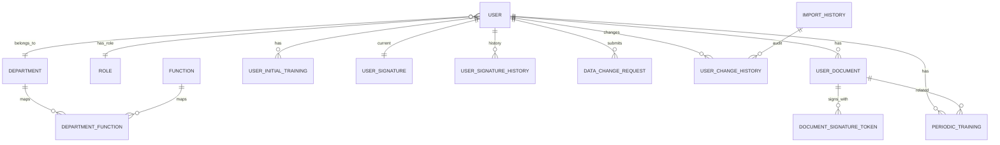

# Data Model

## Overview
- Primary keys are GUIDs.
- Timestamps are written using UTC (DateTime.UtcNow in API workflows).

## Entities and fields

## ER diagram (high level)

### User
Core identity and profile data.
- Id
- DepartmentId, FunctionId, AssignedToId, RoleId
- FirstName, LastName, Email, PersonalId
- PasswordHash, IsEmailVerified
- EmailVerificationToken, EmailVerificationTokenExpiresAt
- PasswordResetToken, PasswordResetTokenExpiresAt
- CreatedAt, UpdatedAt, DeletedAt

SSM/SU form fields:
- DateOfBirth, PlaceOfBirth, Address, BloodGroup, BadgeNumber
- Education, Qualifications
- CommuteRoute, CommuteDurationMinutes
- AdmittedByName, AdmittedByFunction, AdmittedDate

Navigation:
- Department, Role, AssignedTo (line manager)
- AssignedUsers (direct reports)
- Function, PeriodicTrainings, InitialTrainings

### Department
- Id, Name
- IsActive, CreatedAt, UpdatedAt, DeletedAt
- Users, DepartmentFunctions

### Role
- Id, Name, Description, CreatedAt
- Users

### Function
- Id, Name, CreatedAt, UpdatedAt, DeletedAt
- Users, DepartmentFunctions

### DepartmentFunction
- DepartmentId, FunctionId
- Department, Function

### UserDocument
Generated SSM/SU document with signature metadata.
- Id, UserId
- DocumentType (SSM, SU)
- Status (PendingUser, PendingManager, PendingAdmin, Completed)
- GeneratedAt, PdfFilePath
- DocumentHash
- UserCryptographicSignature, ManagerCryptographicSignature, AdminCryptographicSignature
- UserSignatureMethod, UserSignatureData, UserSignatureIpAddress, UserSignedAt
- ManagerSignatureMethod, ManagerSignatureData, ManagerSignatureIpAddress, ManagerSignedAt
- AdminSignatureMethod, AdminSignatureData, AdminSignatureIpAddress, AdminSignedAt

### DocumentSignatureToken
One-time token used for signing links.
- Id, Email
- DocumentId, PeriodicTrainingId
- DocumentName, Token
- ExpiresAt, IsUsed, CreatedAt

### PeriodicTraining
Recurring training record with optional signatures.
- Id, UserId, UserDocumentId
- DocumentType (SSM, SU)
- TrainingDate, DurationHours
- Occupation, MaterialTaught
- UserSignatureData, UserSignatureMethod
- InstructorSignature, InstructorSignatureMethod
- VerifierSignature, VerifierSignatureMethod
- InstructorName, VerifierName
- SourceRowId
- CreatedAt, UpdatedAt

### UserInitialTraining
Initial training data per user per document type.
- Id, UserId, DocumentType
- IntroductoryTrainingDate, IntroductoryTrainingHours
- IntroductoryTrainingInstructor, IntroductoryTrainingInstructorFunction
- IntroductoryTrainingContent
- WorkplaceTrainingDate, WorkplaceTrainingLocation
- WorkplaceTrainingHours, WorkplaceTrainingInstructor, WorkplaceTrainingInstructorFunction
- WorkplaceTrainingContent
- UserSignatureData, UserSignatureMethod
- InstructorSignatureData, InstructorSignatureMethod
- VerifierSignatureData, VerifierSignatureMethod
- CreatedAt, UpdatedAt

### UserSignature
Current active personal signature for a user.
- Id, UserId
- SignatureData, SignatureMethod
- SignatureHash, CryptographicProof
- IpAddress
- CreatedAt, UpdatedAt, RevokedAt

### UserSignatureHistory
Immutable audit log for signature changes.
- Id, UserId
- SignatureData, SignatureMethod
- SignatureHash, CryptographicProof
- IpAddress
- Action (Created, Updated, Revoked)
- PerformedByUserId, PerformedByEmail
- CreatedAt

### ImportHistory
- Id, ImportDate, FileName

### UserChangeHistory
Audit entries for user changes.
- Id, ImportHistoryId, UserId
- FieldName, OldValue, NewValue, Status
- CreatedAt

### DataChangeRequest
User-initiated change request requiring admin approval.
- Id, UserId
- RequestedChangesJson, Reason
- Status (Pending, Approved, Rejected, Awaiting Verification)
- CreatedAt, ResolvedAt, ResolvedByAdminId

## Relationship highlights
- User -> Department (many users per department)
- User -> Role (many users per role)
- User -> AssignedTo (many direct reports per line manager)
- User -> Function (optional)
- Department <-> Function (many-to-many)
- User -> UserDocument (one-to-many)
- User -> UserSignature and UserSignatureHistory (one active, many history)
- User -> PeriodicTraining and UserInitialTraining (one-to-many)

## Indexes and constraints
- Users: unique Email and PersonalId; indexes on DepartmentId and DeletedAt
- Department/Role/Function: unique Name
- DepartmentFunction: composite key (DepartmentId, FunctionId)
- UserInitialTraining: unique (UserId, DocumentType)
- UserSignature: index on UserId (one active record per user)
