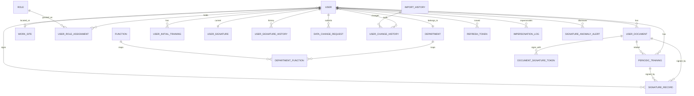

# Data Model

## Overview
- Primary keys are GUIDs.
- Timestamps are written using UTC (DateTime.UtcNow in API workflows).

## Entities and fields

## ER diagram (high level)

```mermaid
erDiagram
	USER }o--|| DEPARTMENT : belongs_to
	USER }o--o| WORK_SITE : located_at
	USER ||--o{ USER_ROLE_ASSIGNMENT : holds
	ROLE ||--o{ USER_ROLE_ASSIGNMENT : granted_as
	USER ||--o{ USER_DOCUMENT : has
	USER ||--o{ PERIODIC_TRAINING : has
	USER ||--o{ USER_INITIAL_TRAINING : has
	USER ||--|| USER_SIGNATURE : current
	USER ||--o{ USER_SIGNATURE_HISTORY : history
	USER ||--o{ DATA_CHANGE_REQUEST : submits
	USER ||--o{ USER_CHANGE_HISTORY : changes

	DEPARTMENT ||--o{ DEPARTMENT_FUNCTION : maps
	FUNCTION ||--o{ DEPARTMENT_FUNCTION : maps

	USER_DOCUMENT ||--o{ DOCUMENT_SIGNATURE_TOKEN : signs_with
	USER_DOCUMENT ||--o{ PERIODIC_TRAINING : related
	USER_DOCUMENT ||--o{ SIGNATURE_RECORD : signed_by
	PERIODIC_TRAINING ||--o{ SIGNATURE_RECORD : signed_by
	USER ||--o{ SIGNATURE_RECORD : signs

	IMPORT_HISTORY ||--o{ USER_CHANGE_HISTORY : audit
	USER ||--o{ REFRESH_TOKEN : issued
	USER ||--o{ IMPERSONATION_LOG : impersonates
	USER ||--o{ SIGNATURE_ANOMALY_ALERT : dismisses
```

Roles are many-to-many via `UserRoleAssignment` — a user can hold zero or more roles at once (e.g. Line Manager + SSM Officer together), not exactly one.

### User
Core identity and profile data.
- Id
- DepartmentId, FunctionId, WorkSiteId, AssignedToId
- FirstName, LastName, Email, PersonalId
- PasswordHash, IsEmailVerified
- EmailVerificationToken, EmailVerificationTokenExpiresAt
- PasswordResetToken, PasswordResetTokenExpiresAt
- IsCsvManaged — true only for accounts whose roster membership is owned by the CSV import pipeline; absence from an imported CSV is only treated as evidence of departure for these accounts, never for seeded or self-registered ones
- CreatedAt, UpdatedAt, DeletedAt

SSM/SU form fields:
- DateOfBirth, PlaceOfBirth, Address, BloodType (enum), BadgeNumber
- Education, Qualifications
- CommuteRoute, CommuteDurationMinutes
- AdmittedByName, AdmittedByFunction, AdmittedDate

Navigation:
- Department, Function, WorkSite, AssignedTo (line manager)
- AssignedUsers (direct reports)
- PeriodicTrainings, InitialTrainings
- RoleAssignments — the roles this user currently holds (see UserRoleAssignment)

### Department
- Id, Name
- IsActive, CreatedAt, UpdatedAt, DeletedAt
- Users, DepartmentFunctions

### WorkSite
- Id, Name
- IsActive, CreatedAt, UpdatedAt, DeletedAt
- Users
Note: unlike Department, having no work site is a valid state — deleting one unassigns its users (`WorkSiteId = null`) rather than requiring a transfer target.

### Role
A grantable role. Users hold zero or more at once via UserRoleAssignment.
- Id, Name (stable code identifier checked by `[Authorize(Roles = ...)]`), Description
- IsSystem — true for built-in roles (Admin, LineManager, BasicUser, SsmOfficer, SuOfficer); the admin UI must refuse to delete or rename these
- CreatedAt
- UserAssignments (navigation to UserRoleAssignment, not directly to User)

### UserRoleAssignment
Join row for the User↔Role many-to-many relationship. Composite primary key (UserId, RoleId).
- UserId, RoleId
- AssignedAt
- AssignedByUserId (nullable — null for system-seeded or backfilled assignments predating any admin action)

### Function
- Id, Name, CreatedAt, UpdatedAt, DeletedAt
- Users, DepartmentFunctions

### DepartmentFunction
- DepartmentId, FunctionId
- Department, Function

### UserDocument
Generated SSM/SU document with signature metadata.
- Id, UserId
- DocumentType (SSM, SU)
- Status (PendingUser, PendingManager, PendingInstructor, Completed; PendingAdmin is legacy-only — no new document reaches it)
- GeneratedAt, PdfFilePath
- DocumentHash
- UserCryptographicSignature, ManagerCryptographicSignature, InstructorCryptographicSignature, AdminCryptographicSignature (legacy)
- UserSignatureMethod, UserSignatureData, UserSignatureIpAddress, UserSignedAt
- ManagerSignatureMethod, ManagerSignatureData, ManagerSignatureIpAddress, ManagerSignedAt
- InstructorSignatureMethod, InstructorSignatureData, InstructorSignatureIpAddress, InstructorSignedAt
- AdminSignatureMethod, AdminSignatureData, AdminSignatureIpAddress, AdminSignedAt (legacy fields, populated only on rows predating the Instructor rename)

### DocumentSignatureToken
One-time token used for signing links.
- Id, Email
- DocumentId, PeriodicTrainingId
- DocumentName, Token
- ExpiresAt, IsUsed, CreatedAt

### PeriodicTraining
Recurring training record with optional signatures.
- Id, UserId, UserDocumentId
- DocumentType (SSM, SU)
- TrainingDate, DurationHours
- Occupation, MaterialTaught
- UserSignatureData, UserSignatureMethod
- InstructorSignature, InstructorSignatureMethod
- VerifierSignature, VerifierSignatureMethod
- InstructorName, VerifierName
- SourceRowId
- CreatedAt, UpdatedAt

### UserInitialTraining
Initial training data per user per document type.
- Id, UserId, DocumentType
- IntroductoryTrainingDate, IntroductoryTrainingHours
- IntroductoryTrainingInstructor, IntroductoryTrainingInstructorFunction
- IntroductoryTrainingContent
- WorkplaceTrainingDate, WorkplaceTrainingLocation
- WorkplaceTrainingHours, WorkplaceTrainingInstructor, WorkplaceTrainingInstructorFunction
- WorkplaceTrainingContent
- UserSignatureData, UserSignatureMethod
- InstructorSignatureData, InstructorSignatureMethod
- VerifierSignatureData, VerifierSignatureMethod
- CreatedAt, UpdatedAt

### UserSignature
Current active personal signature for a user.
- Id, UserId
- SignatureData, SignatureMethod
- SignatureHash, CryptographicProof
- IpAddress
- CreatedAt, UpdatedAt, RevokedAt

### UserSignatureHistory
Immutable audit log for signature changes.
- Id, UserId
- SignatureData, SignatureMethod
- SignatureHash, CryptographicProof
- IpAddress
- Action (Created, Updated, Revoked)
- PerformedByUserId, PerformedByEmail
- CreatedAt

### SignatureRecord
Immutable audit row written on every document/training signing event, separate from the flat signature fields on UserDocument/PeriodicTraining above.
- Id, UserDocumentId, PeriodicTrainingId (nullable)
- SignerRole (User, Manager, Admin), SignerUserId
- SignerFullNameSnapshot, SignerPositionSnapshot, SignerBadgeNumberSnapshot, SignerWorkSiteNameSnapshot (signer identity frozen at signing time; badge number is null on records signed under schema V1, work-site name is null on records signed under schema V1/V2, since neither field existed yet)
- SignatureMethod, SignatureData
- MaterialTaughtSnapshot, DurationHoursSnapshot, TrainingDateSnapshot (training content frozen at signing time, when linked to a PeriodicTraining)
- IpAddress, SignedAt, CreatedAt
- PreviousSignatureHash, SignatureHmac (per-signer HMAC chain; see docs/08_signature-safety.md)
- IsLegacyUnverified (true for rows backfilled before HMAC chaining existed; never treated as verified)
- Version (which SignatureCanonicalSerializer schema computed this record's SignatureHmac — not a resign counter; unrelated to how many times the slot has been re-signed, which is derived from SignedAt)

### ImportHistory
- Id, ImportDate, FileName

### UserChangeHistory
Audit entries for user changes.
- Id, ImportHistoryId, UserId
- FieldName, OldValue, NewValue, Status
- CreatedAt

### RefreshToken
One row per issued refresh token; only the SHA-256 hash is stored, never the raw value.
- Id, UserId
- TokenHash, ExpiresAt, CreatedAt
- ConsumedAt, RevokedAt (nullable)
- ReplacedByTokenHash (nullable) — links a token to its rotation successor, so reuse of an already-consumed token can be detected and the whole chain revoked

### DataChangeRequest
User-initiated change request requiring admin approval. `RequestedChangesJson` is filtered against an allowlist of fields (matching the UI's own field list) both at creation and again at resolve time — Email is excluded here and has its own request-email-change flow.
- Id, UserId
- RequestedChangesJson, OriginalValuesJson (nullable — the pre-change values, snapshotted for the audit trail), Reason
- Status (Pending, Approved, Rejected)
- CreatedAt, ResolvedAt, ResolvedByAdminId
- AutoResolvedByImportHistoryId (nullable) — set when a subsequent CSV sync overtook a still-pending request for the same field, auto-resolving it rather than leaving it stale

### ImpersonationLog
Immutable audit row, one per impersonation start. Never updated or deleted; no `EndedAt`, since impersonation can end either by an explicit stop or by simply expiring (30 min) — there's no single server event to record as "the end."
- Id, ImpersonatorUserId, TargetUserId
- StartedAt, IpAddress

### SignatureAnomalyAlert
One row per signature-verification sweep that found anomalies (Invalid/ChainBroken signatures) — mirrors the live SignalR payload so an admin who wasn't connected when the sweep ran still sees it on next login. Per-signature detail isn't persisted here; it stays in the sweep's log output and the (capped) admin alert email.
- Id
- RecordsChecked, AnomaliesFound
- OccurredAt
- IsRead, ReadAt, ReadByAdminId

## Relationship highlights
- User -> Department (many users per department)
- User <-> Role (many-to-many via UserRoleAssignment)
- User -> WorkSite (optional, many users per site)
- User -> AssignedTo (many direct reports per line manager)
- User -> Function (optional)
- Department <-> Function (many-to-many)
- User -> UserDocument (one-to-many)
- User -> UserSignature and UserSignatureHistory (one active, many history)
- User -> PeriodicTraining and UserInitialTraining (one-to-many)
- UserDocument -> SignatureRecord (one-to-many, one row per signing event)
- PeriodicTraining -> SignatureRecord (optional, one-to-many)
- User -> RefreshToken (one-to-many, active + historical rotation chain)
- User -> ImpersonationLog (one-to-many, as impersonator and as target)
- User -> SignatureAnomalyAlert (as the admin who dismissed it, optional)

## Indexes and constraints
- Users: unique Email and unique PersonalId; index on DeletedAt; composite index on (DepartmentId, DeletedAt); index on WorkSiteId
- Department/Role/Function/WorkSite: unique Name
- DepartmentFunction: composite key (DepartmentId, FunctionId)
- UserRoleAssignment: composite key (UserId, RoleId); secondary index on (RoleId, UserId)
- UserInitialTraining: unique (UserId, DocumentType)
- UserSignature: index on UserId (one active record per user)
- UserSignatureHistory: index on UserId; index on CreatedAt
- UserDocument: index on UserId; index on Status
- PeriodicTraining: index on InstructorId
- DataChangeRequest: index on UserId; index on Status
- UserChangeHistory: index on ImportHistoryId; index on UserId
- SignatureRecord: index on UserDocumentId; index on (PeriodicTrainingId, SignerRole) and on (UserDocumentId, SignerRole) for signing-slot lookups (signature history, most-recent-signature checks); index on (SignerUserId, SignedAt) for HMAC chain lookups
- RefreshToken: unique index on TokenHash; index on UserId
- ImpersonationLog: indexes on ImpersonatorUserId, TargetUserId, and StartedAt
- SignatureAnomalyAlert: indexes on OccurredAt and IsRead
