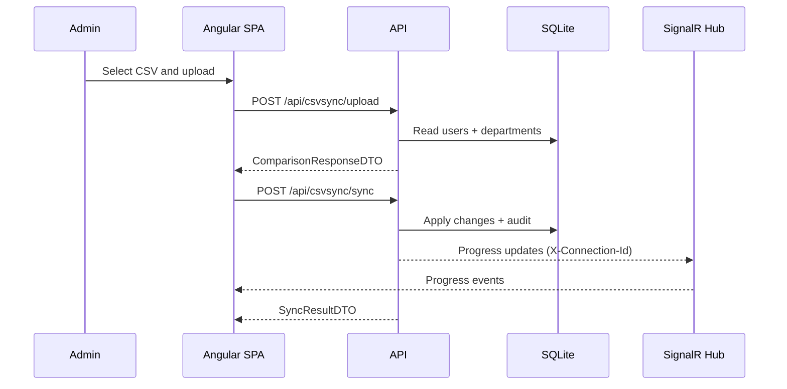
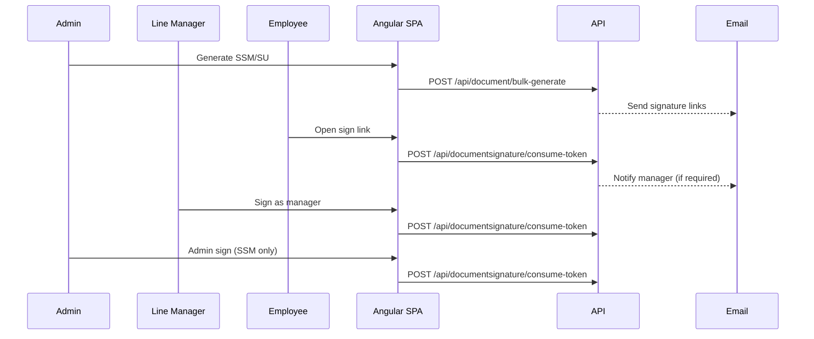
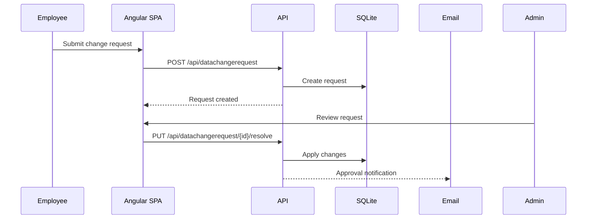

# Business Workflows

## CSV user synchronization
**Objective:** reconcile CSV data with the user master record.

Inputs:
- CSV file with required headers
- Optional query parameter skipInvalidRows

Steps:
1. Upload CSV via POST /api/csvsync/upload.
2. Validation enforces UTF-8, required headers, and email format.
3. The API compares CSV rows with current users and returns conflicts.
4. The client resolves conflicts and submits POST /api/csvsync/sync.
5. ImportHistory and UserChangeHistory are recorded; progress can stream via SignalR.

Validation rules:
- Required headers: PersonalId, FirstName, LastName, Email, DepartmentName
- Optional headers: AssignedToPersonalId, Function
- Invalid rows can be skipped with skipInvalidRows=true

Comparison status values:
- new: record exists in CSV but not in DB
- modified: record exists in both and has at least one conflicting field
- unchanged: record matches DB
- deleted: record exists in DB but not in CSV

Sequence diagram:

## Department CSV synchronization
1. Upload departments via POST /api/csvsync/upload-departments.
2. Differences are computed against active departments.
3. Apply changes via POST /api/csvsync/sync-departments.

## Department lifecycle management
- Deleting a department can optionally transfer users to another department.
- Deletion is soft (IsActive false, DeletedAt set).
- Restores re-enable a department as inactive for review.

## Document generation and signatures
**Documents:** SSM and SU

Sequence:
1. Admin or Line Manager generates documents via /api/document/generate or /bulk-generate.
2. Users receive a signature request email with a secure link.
3. User signs first, then the Line Manager countersigns.
4. For SSM, Admin signs last when status is PendingAdmin.
5. PDFs are generated on demand via /api/document/{documentId}/view-pdf.

Status progression:
- PendingUser -> PendingManager -> PendingAdmin -> Completed
- For SU, the admin signature step is not used.

Token-based signing:
- Validate token: GET /api/documentsignature/validate-token/{token}
- Consume token: POST /api/documentsignature/consume-token
- Tokens are one-time use and expire.

Sequence diagram:

## User signature management
- Users save or revoke their stored signature via /api/usersignature/save and /revoke.
- Each change creates an immutable history entry for audit.

## Data change requests
1. User submits a request via POST /api/datachangerequest.
2. Admin reviews and resolves via PUT /api/datachangerequest/{id}/resolve.
3. Approved requests trigger a notification email.

Notes:
- Email changes are blocked from being requested (the server strips Email from requested changes).

Sequence diagram:

## Training management
- Periodic training records are created and updated through /api/periodictraining.
- Bulk creation supports assigning trainings to multiple users.
- Initial training fields can be applied via /api/user/bulk-initial-training.
- Non-admin users can only target their direct reports.

## Notifications
- User and manager notifications are sent via /api/notification.
- Signature events broadcast a SignatureUpdated SignalR message.
