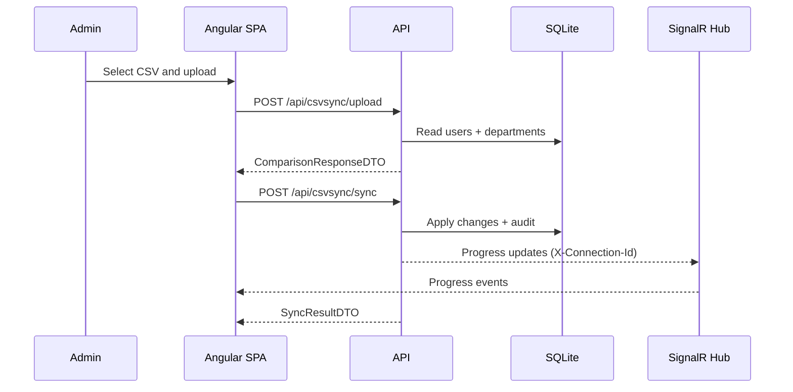
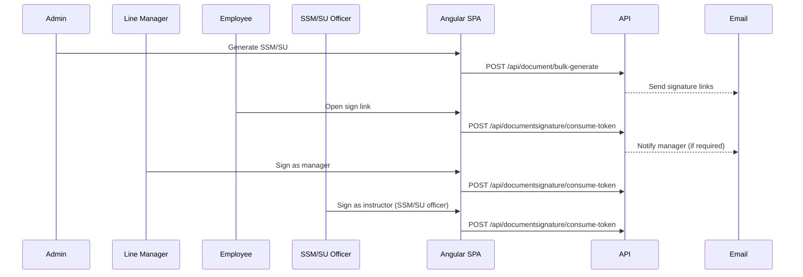
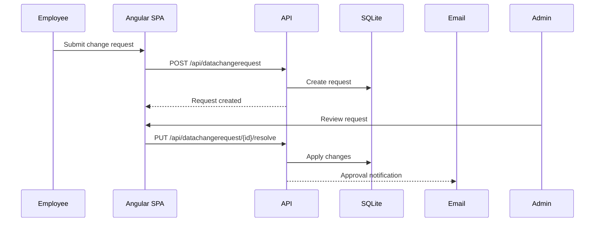

# Business Workflows

## CSV user synchronization
**Objective:** reconcile CSV data with the user master record.

Inputs:
- CSV file with required headers
- Optional query parameter skipInvalidRows

Steps:
1. Upload CSV via POST /api/csvsync/upload.
2. Validation enforces UTF-8, required headers, and email format.
3. The API compares CSV rows with current users and returns conflicts.
4. The client resolves conflicts and submits POST /api/csvsync/sync.
5. ImportHistory and UserChangeHistory are recorded; progress can stream via SignalR.

Validation rules:
- Required headers: PersonalId, FirstName, LastName, Email, DepartmentName
- Optional headers: AssignedToPersonalId, Function, WorkSite
- Invalid rows can be skipped with skipInvalidRows=true

Comparison status values:
- new: record exists in CSV but not in DB
- modified: record exists in both and has at least one conflicting field
- unchanged: record matches DB
- deleted: record exists in DB but not in CSV

Sequence diagram:

```mermaid
sequenceDiagram
	participant Admin as Admin
	participant SPA as Angular SPA
	participant API as API
	participant DB as SQLite
	participant Hub as SignalR Hub

	Admin->>SPA: Select CSV and upload
	SPA->>API: POST /api/csvsync/upload
	API->>DB: Read users + departments
	API-->>SPA: ComparisonResponseDTO
	SPA->>API: POST /api/csvsync/sync
	API->>DB: Apply changes + audit
	API-->>Hub: Progress updates (X-Connection-Id)
	Hub-->>SPA: Progress events
	API-->>SPA: SyncResultDTO
```

## Department CSV synchronization
1. Upload departments via POST /api/csvsync/upload-departments.
2. Differences are computed against active departments.
3. Apply changes via POST /api/csvsync/sync-departments.

## Department lifecycle management
- Deleting a department can optionally transfer users to another department.
- Deletion is soft (IsActive false, DeletedAt set).
- Restores re-enable a department as inactive for review.

## Document generation and signatures
**Documents:** SSM and SU. Both types follow the same signing chain — there is no SSM/SU divergence in the status flow itself.

Sequence:
1. Admin or Line Manager generates documents via `/api/document/generate`, `/bulk-generate`, or the async `/bulk-generate-async` (polled via `/bulk-generate-status/{jobId}`).
2. Users receive a signature request email with a secure link.
3. User signs first, then the Line Manager (the user's `AssignedTo`) countersigns.
4. The document-type's officer (`SsmOfficer` for SSM, `SuOfficer` for SU) signs last, filling the "Instructor" slot — any employee's document, not limited to a reporting line.
5. PDFs are generated on demand via `/api/document/{documentId}/view-pdf`.

Status progression:
- `PendingUser -> PendingManager -> PendingInstructor -> Completed`
- `PendingAdmin` is a legacy-only status: no document reaches it under the current flow, but historical rows created before this design may still carry it.
- The trainee can never sign their own manager/instructor steps, even if they hold the officer or manager role themselves — someone else must fill those slots.

Bulk signing (officer/manager self-service, rather than one-link-at-a-time email signing):
- `POST /api/documentsignature/bulk-sign` — synchronous bulk sign for the caller's pending documents.
- `POST /api/documentsignature/bulk-sign-async` — background job variant, polled via `GET /api/documentsignature/bulk-sign-status/{jobId}`.
- `GET /api/documentsignature/pending-ssm-admin-count` — count of legacy `PendingAdmin` rows still awaiting resolution (naming predates the Instructor rename).

Signing queues:
- `GET /api/document/my-pending-signatures`, `/my-signed-documents` — the employee's own documents.
- `GET /api/document/manager-pending-signatures`, `/manager-signed-documents` — documents awaiting the caller as manager.
- `GET /api/document/instructor-pending-signatures`, `/instructor-signed-documents` — documents awaiting the caller as SSM/SU officer.
- `GET /api/document/admin-pending-signatures`, `/admin-signed-documents` — legacy `PendingAdmin` rows only.

Token-based signing (the one-link-per-email flow):
- Validate token: GET /api/documentsignature/validate-token/{token}
- Consume token: POST /api/documentsignature/consume-token
- Tokens are one-time use and expire.

Sequence diagram:

```mermaid
sequenceDiagram
	participant Admin as Admin
	participant Manager as Line Manager
	participant User as Employee
	participant Officer as SSM/SU Officer
	participant SPA as Angular SPA
	participant API as API
	participant Mail as Email

	Admin->>SPA: Generate SSM/SU
	SPA->>API: POST /api/document/bulk-generate
	API-->>Mail: Send signature links
	User->>SPA: Open sign link
	SPA->>API: POST /api/documentsignature/consume-token
	API-->>Mail: Notify manager (if required)
	Manager->>SPA: Sign as manager
	SPA->>API: POST /api/documentsignature/consume-token
	Officer->>SPA: Sign as instructor (SSM/SU officer)
	SPA->>API: POST /api/documentsignature/consume-token
```

## User signature management
- Users save or revoke their stored signature via /api/usersignature/save and /revoke.
- Each change creates an immutable history entry for audit.

## Data change requests
1. User submits a request via POST /api/datachangerequest.
2. Admin reviews and resolves via PUT /api/datachangerequest/{id}/resolve.
3. Approved requests trigger a notification email.

Notes:
- Requested changes are filtered against an allowlist of fields (the same set the UI itself offers) both when the request is created and again when it is resolved; anything outside that allowlist is silently dropped rather than persisted or applied.
- Email cannot be changed through this flow. It has a separate, dedicated endpoint instead: `POST /api/datachangerequest/request-email-change`, which requires the new address to share the same domain as the user's current one.
- `GET /api/datachangerequest/pending-count` returns the count of unresolved requests, used for badge/notification counters.

Sequence diagram:

```mermaid
sequenceDiagram
	participant User as Employee
	participant SPA as Angular SPA
	participant API as API
	participant DB as SQLite
	participant Mail as Email

	User->>SPA: Submit change request
	SPA->>API: POST /api/datachangerequest
	API->>DB: Create request
	API-->>SPA: Request created
	Admin->>SPA: Review request
	SPA->>API: PUT /api/datachangerequest/{id}/resolve
	API->>DB: Apply changes
	API-->>Mail: Approval notification
```

## Training management
- Periodic training records are created and updated through /api/periodictraining.
- Bulk creation supports assigning trainings to multiple users.
- Initial training fields can be applied via /api/user/bulk-initial-training.
- Non-admin users can only target their direct reports.

## Notifications
- `POST /api/notification/notify-user/{userId}` — send a notification email to a specific user.
- `POST /api/notification/notify-manager/{managerId}` — send a notification email to a specific manager.
- `POST /api/notification/notify-all-managers` — broadcast a notification email to every Line Manager.
- Signature events broadcast a `SignatureUpdated` SignalR message.
- Signature anomaly alerts (unexpected signature verification failures) surface via `GET /api/signatureanomalyalert/unread` and are cleared with `POST /api/signatureanomalyalert/dismiss-all`.

## Impersonation ("view as")
Lets an Admin act in the app as another user, for support/troubleshooting, without knowing their password.

1. Admin starts impersonation: `POST /api/impersonation/impersonate/{userId}`. The response carries the target user's session; the admin's own refresh tokens are revoked for the duration so the two sessions can't be mixed up.
2. While impersonating, the session is read-only for state-changing actions outside the normal user experience — enforced server-side, not just hidden in the UI — and the impersonation is time-boxed (30 minutes, no refresh token issued, so it lapses on its own rather than persisting indefinitely).
3. `GET /api/authentication/me` returns the impersonation state, including the original admin's identity, so the client can render an "impersonating as X" banner.
4. Admin ends impersonation: `POST /api/authentication/stop-impersonation`, returning to their own session.
5. Every impersonation start/stop is recorded to an audit log (`ImpersonationLog`) for later review.
