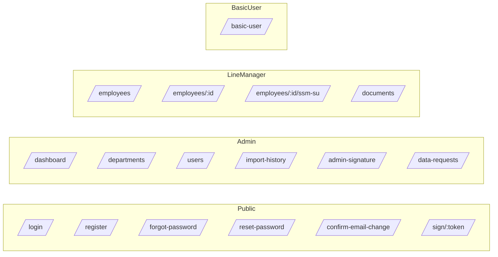

# Client Application

## Overview
The SyncApp26 client is an Angular 21 SPA that provides role-based access to HR synchronization, document signing, and training workflows. Session auth rides on an httpOnly cookie (no token in JS); SignalR is used for real-time updates.

## Runtime settings
- API base URL: src/environments/environment.ts (relative `/api`, routed through the dev proxy — see proxy.conf.json)
- Default dev server: http://localhost:4200

## Project layout
Key directories under SyncApp26.Client/src/app:

Components (selected):
- dashboard, departments, users-list, employees-detail
- ssm-su-form, import-history, comparison-view
- login, register, forgot-password, reset-password
- header, footer, loading-screen, pagination

Pages:
- admin-signature
- confirm-email-change
- data-change-requests
- document-signature
- documents-view
- test-signature

Services:
- authentication.service.ts: login, logout, session hydration from GET /me
- user-sync.service.ts: CSV user sync and local state
- departments-sync.service.ts: department sync
- user-sync.signalr.service.ts: SignalR connection and events
- document-signature.service.ts: signing workflows
- user-signature.service.ts: user signature CRUD
- data-change-request.service.ts: requests and approval
- notification.service.ts: email notifications
- version.service.ts: API version display

Guards and interceptors:
- auth.interceptor sets withCredentials so the session cookie is sent
- refresh.interceptor retries a 401 after a single-flight POST /refresh
- error.interceptor logs out (or drops impersonation) on a 401 that survives refresh
- AuthGuard requires login
- AdminGuard restricts admin routes
- LineManagerGuard allows Line Manager or Admin

## Authentication and session
- No token is ever held in JS. An app initializer calls GET /me before the router's first
  navigation, populating an in-memory session (BehaviorSubject in authentication.service.ts).
- Logout POSTs /logout, then hard-redirects to /login so all in-memory state resets.
- The session's roles array is used by guards to gate routes.

## Route map by role

```mermaid
flowchart LR
	subgraph Public
		Login[/login/]
		Register[/register/]
		Forgot[/forgot-password/]
		Reset[/reset-password/]
		Confirm[/confirm-email-change/]
		Sign[/sign/:token/]
	end

	subgraph Admin
		Dashboard[/dashboard/]
		Departments[/departments/]
		Users[/users/]
		ImportHistory[/import-history/]
		AdminSignature[/admin-signature/]
		DataRequests[/data-requests/]
	end

	subgraph LineManager
		Employees[/employees/]
		EmployeeDetail[/employees/:id/]
		SsmSu[/employees/:id/ssm-su/]
		Documents[/documents/]
	end

	subgraph BasicUser
		Basic[/basic-user/]
	end
```

Public routes:
- /login
- /register
- /forgot-password
- /reset-password
- /confirm-email-change
- /sign/:token

Authenticated routes:
- /basic-user
- /line-manager
- /access-restricted

Admin routes:
- /dashboard
- /departments
- /users
- /import-history
- /test-signature
- /admin-signature
- /data-requests

Line Manager routes:
- /employees
- /employees/:id
- /employees/:id/ssm-su
- /documents

## CSV sync and progress streaming
- user-sync.service.ts manages CSV upload and sync results.
- user-sync.signalr.service.ts connects to /hubs/sync and listens for:
	- UploadProgress { message, percent }
	- ComparisonResult (UserComparison)
	- SyncProgress { processed, failed, skipped }
	- SignatureUpdated (no payload)

## Error handling model
- Services return Observables; components handle errors and display messages.
- Authorization failures redirect to /access-restricted or /login.
